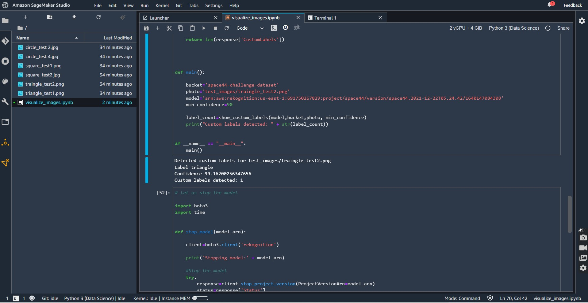
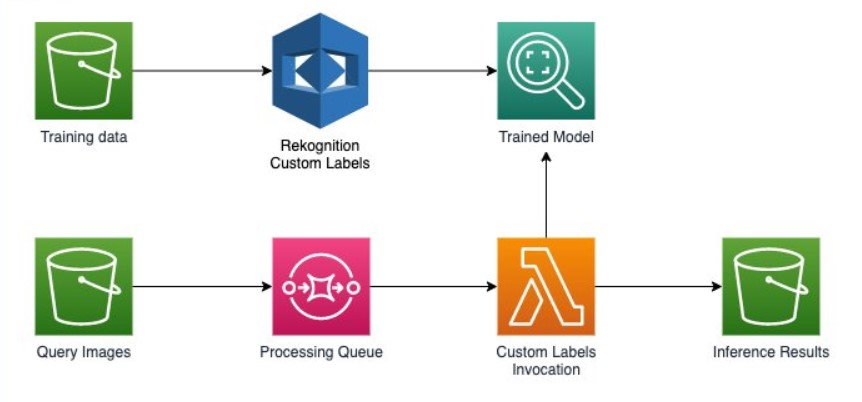

# SHAPE classification using Amazon Rekognition Custom Labels

Video showing inference - https://screenrec.com/share/0Y8SaEw3An |||
| -------------- |
||!

## Introduction
This repo describes how to train a model that can categorize shapes.
I will be building just the back end as I have little experience with the front end.

## Architecture
|||
| -------------- |
||!

The shape classification model was trained using Amazon Rekognition custom labels and inferencing is done using custom lambda functions and the SQS processing qeue.

The process of training the model is described step by step and was configured and deployed by AWS cloud formation using a YAML template file.

These are the high-level steps for preparing our model:

1 - Access the AWS CloudFormation console and deploy the template.yaml as a new stack.

2 -  Prepare and preprocess the data into an S3 bucket.

3 - Use Amazon Rekognition Custom Labels to train the model.

4 - After model training, I took advantage of Amazon Rekognition Custom Labels  API calls for starting, using, and stopping a model using a serverless architecture. It uses an AWS Lambda function to call the inference API and manages these API calls using Amazon SQS.

5 - I uploaded my test images to a test folder in my s3 bucket and validated my model using inference code written in visualize_images.ipynb.

The model took roughly an hour to train. The model achieved an average precision of 98% with a recall of 92% on the test data. 

I could squeeze out more accuracy using a DIY model but sacrificing speed and ease of building.

This is not production worthy as there are security flaws such as
- using a Virtual Private Cloud to be able to access VPC-only resources and, resources which cannot be accessed outside a VPC network.
- Ensure data stored on Machine Learning (ML) storage volumes attached to the notebook instances are encrypted to protect SageMaker data at rest.
- Notebook instances must not be publicly accessible.

The model will be monitored for drifts, skews, and errors using cloudwatch by AWS.

Depending on the domain, an automated pipeline can be built to trigger auto training of the model due to changes in the code or dataset.

I would like to point out that I am more experienced at building end-to-end conversational AI's for contact centers, Intelligent search, and Intelligent document processing systems.

I AM NOT EXPERIENCED WITH THE FRONT END BUT I AM WILLING TO LEARN.

website/profile - https://ayoolafakoya.com
github - https://github.com/Ayo-faks

